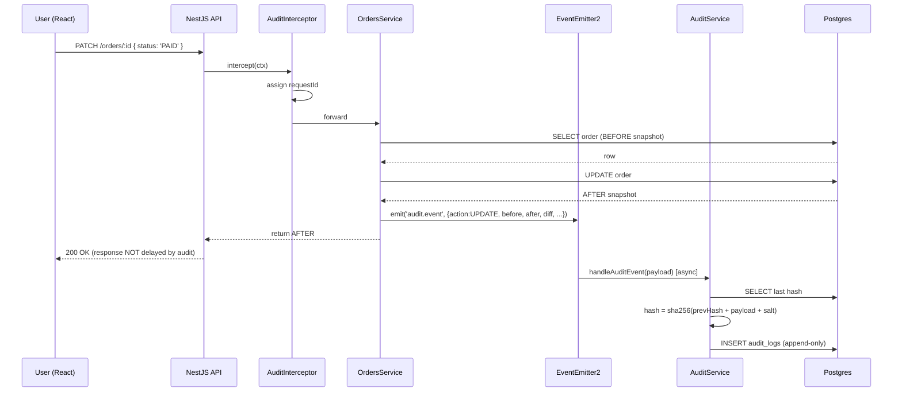
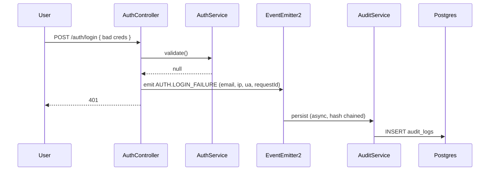

# Architecture

## Goals

1. Capture **every** user/system action of interest (auth, CRUD, permission change)
2. Record full **metadata** (who, what, when, where, how)
3. Preserve **before / after** state for data modifications
4. Make logs **searchable** and **exportable**
5. Make tampering **detectable**
6. Don't block the request thread

## Components

```
┌───────────────────────────┐    HTTP    ┌─────────────────────────────┐
│  React (Vite, port 5173)  │  ───────►  │  NestJS API (port 3000)     │
└───────────────────────────┘            │                              │
                                          │   ┌──────────────────────┐   │
                                          │   │ Global Interceptor    │   │
                                          │   │ (request meta + ID)   │   │
                                          │   └─────────┬────────────┘   │
                                          │             │                 │
                                          │   ┌─────────▼────────────┐   │
                                          │   │ JwtAuthGuard /        │   │
                                          │   │ RolesGuard            │   │
                                          │   └─────────┬────────────┘   │
                                          │             │                 │
                                          │   ┌─────────▼────────────┐   │
                                          │   │ Controllers          │   │
                                          │   │ Auth / Users / Orders │   │
                                          │   └─────────┬────────────┘   │
                                          │             │                 │
                                          │   ┌─────────▼────────────┐   │
                                          │   │ Services              │   │
                                          │   │ (emit audit.event)    │   │
                                          │   └─────────┬────────────┘   │
                                          │             │                 │
                                          │   ┌─────────▼────────────┐   │
                                          │   │ EventEmitter2 bus    │   │
                                          │   └─────────┬────────────┘   │
                                          │             │ async           │
                                          │   ┌─────────▼────────────┐   │
                                          │   │ AuditService          │   │
                                          │   │ (hash chain + persist)│   │
                                          │   └─────────┬────────────┘   │
                                          │             │                 │
                                          │   ┌─────────▼────────────┐   │
                                          │   │ Prisma → Postgres     │   │
                                          │   │ audit_logs (append-   │   │
                                          │   │ only)                 │   │
                                          │   └──────────────────────┘   │
                                          └─────────────────────────────┘
```

## Capture Strategy — Hybrid

| Source | What it captures | Why |
|---|---|---|
| **Global Interceptor** (`AuditInterceptor`) | Request ID, HTTP metadata, `CREATE` response bodies for endpoints tagged with `@Audit({ action: 'CREATE' })` | Always-on, transparent capture of HTTP context — saves controllers from boilerplate |
| **Service-level emit** | Full `before` / `after` snapshots for `UPDATE`, `DELETE`, and the diff between them | The interceptor can't see the *previous* row — only the service knows it |
| **Auth controller** (`manual: true`) | Login success/failure, logout, register | Needs custom user resolution (failure has no `req.user`, login has just-issued user) |

The interceptor + decorator combination keeps controllers clean:
```ts
@Post()
@Audit({ action: 'CREATE', entity: 'Order' })
create(...) { ... }   // CREATE event auto-fired post-response
```

## Sequence — Order Update with Before/After



## Sequence — Failed Login



## Hash Chain

Every row stores:
- `prevHash` — the previous row's `hash` (NULL only for the first row)
- `hash` — `SHA-256(salt || JSON(prevHash, payload))`

To verify integrity:
1. Walk rows by `id ASC`.
2. Recompute each row's hash from `prevHash` + payload.
3. Compare to stored `hash`.
4. Any mismatch → tampering / corruption detected.

This is implemented in `AuditService.verifyChain()` and exposed via `GET /audit-logs/verify` and the "Verify chain" button.

Because the hash depends on `prevHash`, deleting or altering *any* historical row invalidates every subsequent row's hash.

## Why async writes?

Synchronous DB writes for every action double the request latency. By emitting the audit event and returning, the user-facing response is unaffected. The `AuditService` chains writes (serial queue) so the hash chain stays consistent even under concurrent requests.

**Tradeoff:** If the process crashes between the emit and the persist, the audit row is lost. For a production system, replace `EventEmitter2` with a durable queue (e.g., **Outbox pattern**: write the audit event to an `outbox` table in the same DB transaction as the business change, then a worker drains it into `audit_logs`).
